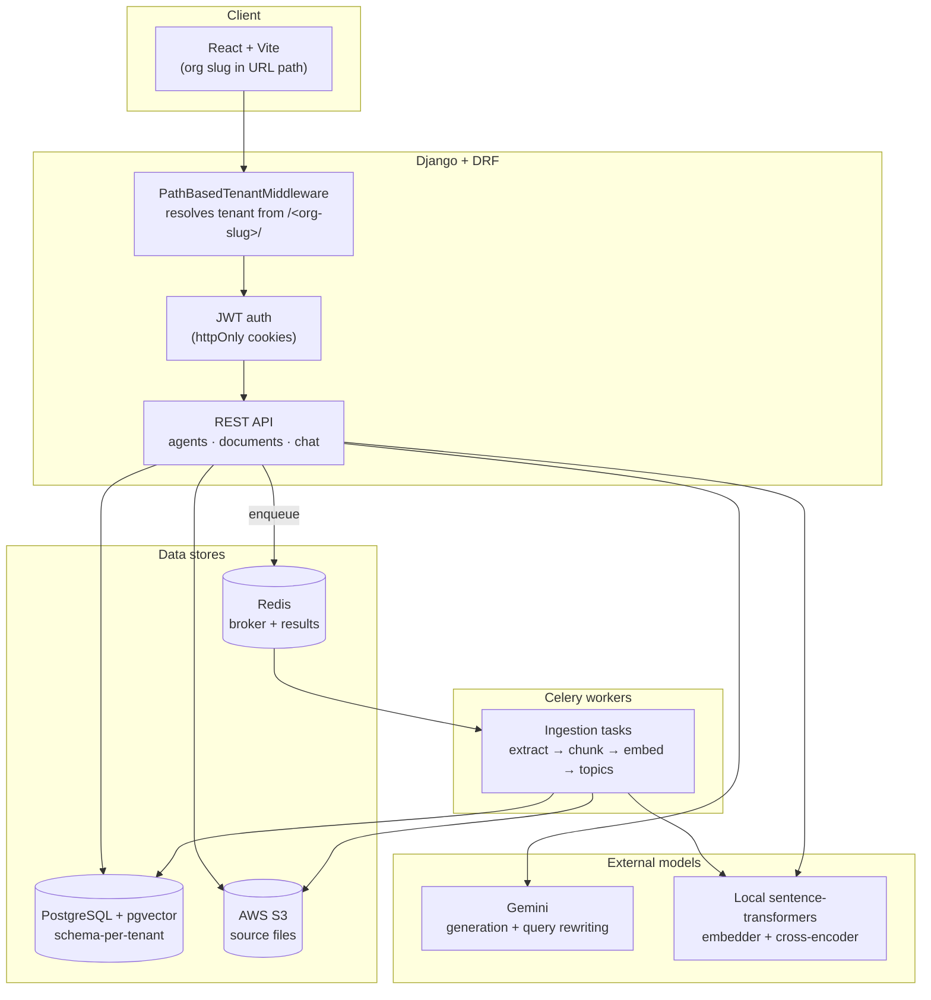
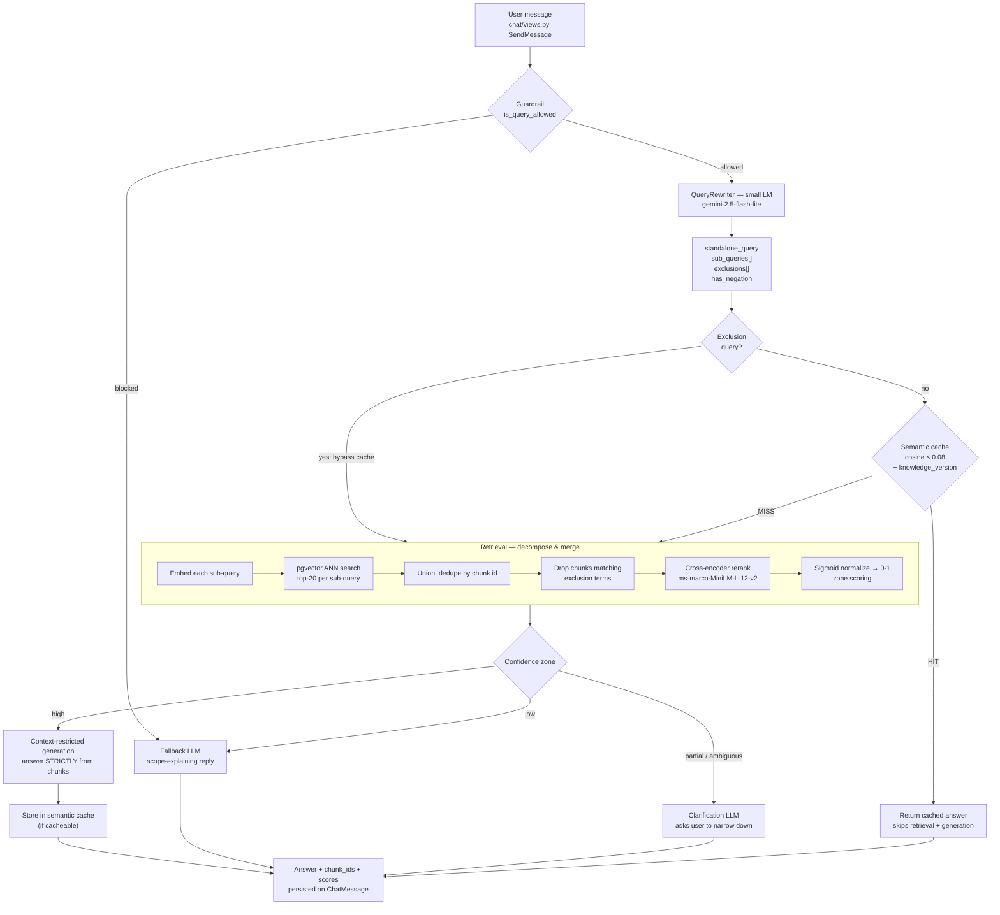

# Knowledge-Based Conversational AI Agent Platform

A multi-tenant Retrieval-Augmented Generation (RAG) platform: Django (schema-per-tenant via `django-tenants`) + DRF + PostgreSQL/pgvector + Redis + Celery + Gemini, with a React/Vite frontend.

This README covers first-time local setup.

**Pipeline highlights:** small-LM query rewriting (follow-up resolution, multi-part decomposition, negation/exclusion extraction), decompose-and-merge retrieval over pgvector with cross-encoder reranking, confidence-zone routing, and a pgvector-backed semantic cache with knowledge-version invalidation.

## Architecture

### System overview

Each organization is a **tenant** with its own isolated Postgres schema. Documents,
chunks, embeddings, agents, chats, and cached answers all live inside the tenant
schema, so no tenant can read another's data at the database level.



### Ingestion pipeline (async)

Upload returns immediately; all heavy work happens in Celery so the request never
blocks on model inference. The document's `status` field tracks progress
(`uploaded → processing → ready`).

```mermaid
flowchart LR
    A["POST /documents/upload<br/>file"] --> B["Upload to S3<br/>tenant-scoped key"]
    B --> C["Document row<br/>status=uploaded"]
    C --> D["process_document.delay<br/>(document_id, schema_name)"]

    subgraph celery["Celery worker — inside schema_context(tenant)"]
        D --> E["status=processing"]
        E --> F["Download from S3"]
        F --> G["extract_text<br/>PDF · DOCX · TXT · CSV"]
        G --> H["chunk_text<br/>Recursive splitter<br/>1000 chars / 200 overlap"]
        H --> I["save_chunks<br/>bulk_create"]
        I --> J["embed_document_chunks<br/>fan-out, batches of 64"]
        J --> K["all-mpnet-base-v2<br/>768-dim, normalized"]
        K --> L["bulk_update embeddings<br/>HNSW cosine index"]
        L --> M["extract_document_topics<br/>RAKE keywords → meta_data"]
        M --> N["status=ready"]
    end
```



Topics extracted here are reused at query time: when retrieval finds nothing
relevant, the fallback answer tells the user what the agent *can* discuss instead
of hallucinating.

### Query pipeline



**Query rewriting** turns a context-dependent message into a self-contained one
("what about theirs?" → "what is Acme's refund policy?"), splits genuine multi-part
questions into sub-queries retrieved independently, and extracts exclusions —
"smartphones apart from Nokia" retrieves *smartphones* and filters Nokia chunks out
of the results, rather than hoping the generator honors the negation.

**Confidence zones** decide whether to answer at all, using the reranker's
normalized top/average scores and the gap to the runner-up chunk:

| Zone | Condition | Action |
|---|---|---|
| `high` | top > 0.72, or > 0.60 with a clear winner | Answer strictly from retrieved context |
| `ambiguous` | strong scores, tiny gap between top two | Ask the user to clarify |
| `partial` | avg ≥ 0.30 but no confident leader | Ask the user to clarify |
| `low` | avg < 0.30 | Decline, and list topics the agent does cover |

### Guardrails

| Layer | Mechanism |
|---|---|
| Tenant isolation | Separate Postgres schema per org; every query runs inside `schema_context` |
| Auth | JWT in httpOnly cookies; `IsAuthenticated` is the DRF default permission class |
| Scope control | Blocklist rejects off-purpose prompts (code generation, jokes, translation, …) before any retrieval |
| Grounding | High-confidence answers are generated with an "answer ONLY from the context, do NOT use prior knowledge" prompt |
| Abstention | Low-confidence retrieval never reaches the generator — it routes to fallback or clarification |
| Exclusion honoring | Excluded entities are filtered out of retrieval results, not just discouraged in the prompt |
| Cache correctness | Cache keys carry a `knowledge_version` fingerprint of the agent's documents, so edits invalidate stale answers; exclusion queries bypass the cache entirely to prevent key collisions |
| Cache precision | Hits require cosine distance ≤ 0.08 (~0.92 similarity), tuned strict to avoid wrong-answer hits |

## Prerequisites

- Python 3.13 (managed via [`uv`](https://docs.astral.sh/uv/))
- Node.js + npm (for the frontend)
- Docker (for Postgres/pgvector, Redis, pgAdmin)

## 1. Start infrastructure

From the repo root:

```bash
docker-compose up -d
```

This starts:
- `postgres` — Postgres 16 with the `pgvector` extension available, on `localhost:5432` (db `db`, user `user`, password `password`)
- `redis` — on `localhost:6379` (used as both Celery broker and app cache)
- `pgadmin` — on `localhost:8080` (optional, for inspecting the DB)

## 2. Backend setup

```bash
cd backend
uv sync
```

### 2.1 Environment variables

Create `backend/.env` with the following keys (see `config/settings.py` for what each is used for):

```
EMAIL_BACKEND=
EMAIL_HOST=
EMAIL_PORT=
EMAIL_USE_TLS=
EMAIL_HOST_USER=
EMAIL_HOST_PASSWORD=
DEFAULT_FROM_EMAIL=

AWS_ACCESS_KEY=
AWS_SECRET_KEY=
AWS_S3_REGION=
AWS_STORAGE_BUCKET_NAME=
S3_PRESIGNED_URL_EXPIRY=3600

GEMINI_API_KEY=

HF_TOKEN=
```

Optional RAG tuning knobs (all have working defaults, override only if you want to):

```
REWRITER_MODEL=gemini-2.5-flash-lite      # small model used for query rewriting
SEMANTIC_CACHE_ENABLED=True
SEMANTIC_CACHE_DISTANCE_THRESHOLD=0.08    # cosine distance; ~0.92 similarity
SEMANTIC_CACHE_TTL=1800                   # seconds
```

- `GEMINI_API_KEY` is required for chat/query answering to work at all (Gemini is the only LLM provider currently wired up).
- `AWS_*` are required for document upload/download (S3 storage) — documents can't be processed without a working bucket.
- `HF_TOKEN` is optional but recommended — without it, Hugging Face Hub downloads of the embedding/reranker models are rate-limited.
- `EMAIL_*` are required for the invite-user / password-reset flows to actually send email; not required just to get the app running.

### 2.2 Enable the `pgvector` Postgres extension

**Required once per fresh database.** On a brand-new `docker-compose` Postgres volume, enable the extension before creating any tenant schema:

```bash
docker exec -it postgres psql -U user -d db -c "CREATE EXTENSION IF NOT EXISTS vector;"
```

### 2.3 Run migrations (shared/public schema)

```bash
python manage.py migrate_schemas --shared
```

### 2.4 Create the `public` tenant

Required — the tenant-resolution middleware falls back to a tenant with `schema_name='public'` whenever a request's org slug doesn't match a real tenant, so this must exist or every request will error:

```bash
python manage.py create_custom_tenant public "Public" localhost
```

### 2.5 Create your organization (tenant)

Domain format matters: the app resolves tenants by path (`kbc.com/<org-slug>`), and locally that means the `Domain` value must be exactly `localhost/<schema_name>` (no port, no scheme) — the middleware strips the port before matching.

```bash
python manage.py create_custom_tenant acme "Acme Inc" localhost/acme
```

### 2.6 Create a user inside that tenant

```bash
python manage.py create_tenant_user acme myuser mypassword --email me@example.com
```

This creates a regular (non-admin) user. To make a user an app-level admin (`role=1`, checked in a couple of places like document visibility) or a Django-admin-site superuser, do it via shell:

```bash
python manage.py shell -c "
from django_tenants.utils import tenant_context
from core.models import Organization
from users.models import User

tenant = Organization.objects.get(schema_name='acme')
with tenant_context(tenant):
    user = User.objects.get(username='myuser')
    user.role = 1          # 1 = admin
    user.is_staff = True   # optional: Django admin site access
    user.is_superuser = True
    user.save()
"
```

### 2.7 Run the Django dev server

```bash
python manage.py runserver
```

### 2.8 Run the Celery worker

```bash
celery -A config worker --loglevel=info
```

**macOS note:** the embedding/reranker models are `torch`-backed, and Celery's default `fork()`-based `prefork` pool doesn't play well with native ML libraries on macOS. On macOS, run the worker with the thread pool:

```bash
celery -A config worker --loglevel=info --pool=threads --concurrency=8
```

Also make sure Redis is up (step 1) before starting the worker — `CELERY_BROKER_URL`/`CELERY_RESULT_BACKEND` point at `redis://localhost:6379`.

## 3. Frontend setup

```bash
cd frontend
npm install
npm run dev
```

The frontend points at the backend via the base URL in `frontend/src/api/axios.js`, which defaults to `http://localhost:8000/`.

## 4. Using the app

1. Open the frontend, enter your org slug (e.g. `acme`) on the entry screen.
2. Log in with the user created in step 2.6.
3. Upload a document — this kicks off a Celery task (`documents.tasks.process_document`) that extracts text, chunks it, generates embeddings, and extracts topic metadata.
4. Create an agent, attach the document(s) to it, and start a chat.

## Adding another tenant later

Repeat steps 2.5–2.6 with a new schema name/domain. If you've added new migrations since the last tenant was created, apply them to existing tenants explicitly:

```bash
python manage.py migrate_schemas --schema=<schema_name>
```

New tenants created after a migration exists pick it up automatically (schema creation runs all pending tenant-app migrations).

## Project layout

```
backend/
  config/      Django settings, Celery app, root URLs
  api/         JWT auth endpoints (cookie-based), API root, dashboard metrics
  common/      PathBasedTenantMiddleware (resolves tenant from URL path)
  core/        Organization (tenant) + Domain models, tenant management commands
  users/       Custom user model, auth, invites
  agent/       Agent + Tag models, agent API, answer orchestration
  documents/   Upload, S3 storage, async processing (extract → chunk → embed)
  chat/        Chat sessions and messages
  rag/         Retrieval pipeline: embeddings, chunker, retriever,
               query rewriter, semantic cache, LLM providers
frontend/      React + Vite client
```

The RAG request path lives in `agent/services/agent_service.py:generate_agent_answer`, entered from `chat/views.py:SendMessage`.
